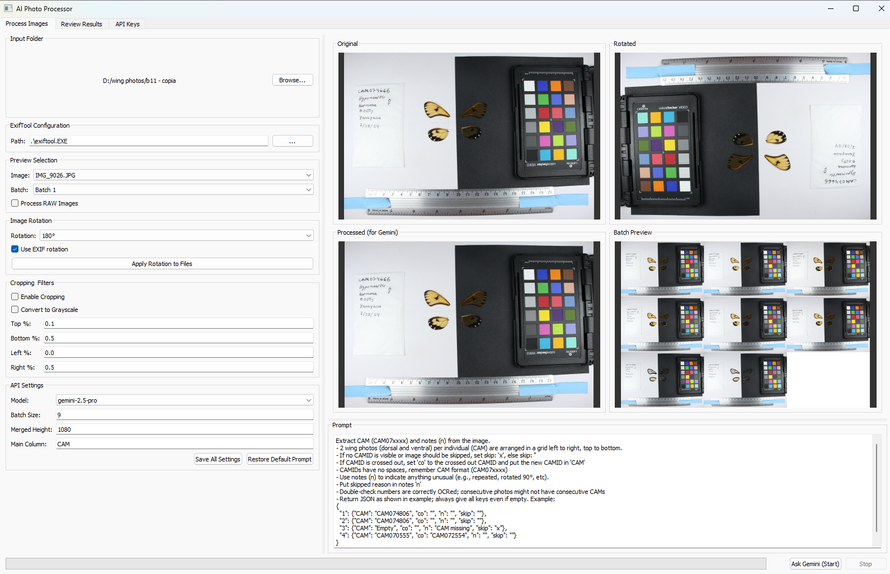

# AI Photo Processor

The AI Photo Processor is a desktop application designed to streamline the process of cataloging large batches of photos, particularly for scientific specimen collections. It leverages the Google Gemini Vision API to automatically extract text-based data (like specimen IDs) from images and provides a powerful interface to review, correct, and rename the corresponding files.



## Key Features

### Automated Data Extraction
- **Gemini Vision Integration**: Uses Google's AI to perform Optical Character Recognition (OCR) on your images, extracting specimen IDs, notes, and other data based on a customizable prompt.
- **Model Selection**: Choose between faster (Gemini Flash) or more accurate (Gemini Pro) models.
- **Batch Processing**: Process entire folders of images in manageable batches, with progress displayed in real-time.
- **Multi-API Key Support**: Enter multiple Gemini API keys. The application will automatically rotate through them if one hits a rate limit, ensuring long-running jobs can complete without interruption.

### Powerful Image Processing Workflow
- **Live Previews**: See exactly how your images are processed before sending them to the API with live previews for rotation, cropping, and batch merging.
- **Advanced Rotation**: Apply rotation (0°, 90°, 180°, 270°) to entire folders. It safely modifies EXIF orientation tags for all common image types, including RAW formats like .CR2, .ORF, and .TIF (requires exiftool).
- **Customizable Pre-processing**:
  - **Cropping**: Visually define a crop area to focus the AI on the relevant part of your images.
  - **Grayscale Filter**: Convert images to grayscale to potentially improve OCR accuracy.

### Efficient Review & Renaming Interface
- **Smart Data Review**: Displays images grouped by their extracted ID, making it easy to verify pairs and spot errors. The interface highlights items that don't have a matching pair.
- **Pair Verification**: Easily identify missing or duplicate wing pairs (dorsal/ventral).
- **In-Line Editing**: Directly edit all data in text fields next to each image. Changes are autosaved to a temporary file to prevent data loss.
- **Pagination & Quality Control**: For very large folders, the review tab is paginated for fast performance. You can also adjust the thumbnail quality to balance detail and memory usage.
- **Safe Renaming**:
  - **Calculate Final Names**: Automatically generate new filenames based on the corrected IDs and a defined suffix pattern.
  - **Rename & Log**: Execute the renaming for both compressed files and their corresponding RAW pairs. All operations are logged.
  - **Restore Original Names**: A one-click "Restore" button uses the log file to revert all renamed files back to their original names.

## Prerequisites

- **Python**: Python 3.9 or newer.
- **ExifTool**: Required for rotating RAW image files (.CR2, .ORF, etc.). Download it from the official ExifTool website and ensure its location is added to your system's PATH or specified within the app.
- **Google Gemini API Key**: You need at least one API key, which you can get from Google AI Studio.

## Installation

### Clone or Download the Repository:
```bash
git clone https://github.com/your-username/your-repo-name.git
cd your-repo-name
```

### Install Dependencies:
It is highly recommended to use a virtual environment.

```bash
# Create and activate a virtual environment (optional but recommended)
python -m venv venv
source venv/bin/activate  # On Windows, use `venv\Scripts\activate`

# Install the required packages
pip install -r requirements.txt
```

## How to Use

### Run the Application:
```bash
python main.py
```

### API Keys Tab:
1. Go to the "API Keys" tab.
2. Paste your Google Gemini API key(s), one per line.
3. Click "Save API Keys".

### Process Images Tab:
1. Click "Browse..." to select the folder containing your images.
2. If you are processing RAW files and exiftool is not in your system's PATH, specify the path to the executable.
3. Adjust rotation, cropping, and batch size settings as needed.
4. Customize the prompt to instruct the AI on what data to extract.
5. Click "Ask Gemini (Start)" to begin the process.

### Review Results Tab:
1. Once processing is complete (or to view a previous session), go to the "Review Results" tab.
2. The most recent CSV data file will be loaded automatically.
3. Review the extracted data and make any corrections in the text fields. Changes are autosaved.
4. When you are satisfied with the data, click "Recalculate Final Names" to generate the new filenames in the 'to' column. This will create a new 'checked' version of your CSV.
5. Finally, click "Rename Files" to apply the new names to your image files on disk. 