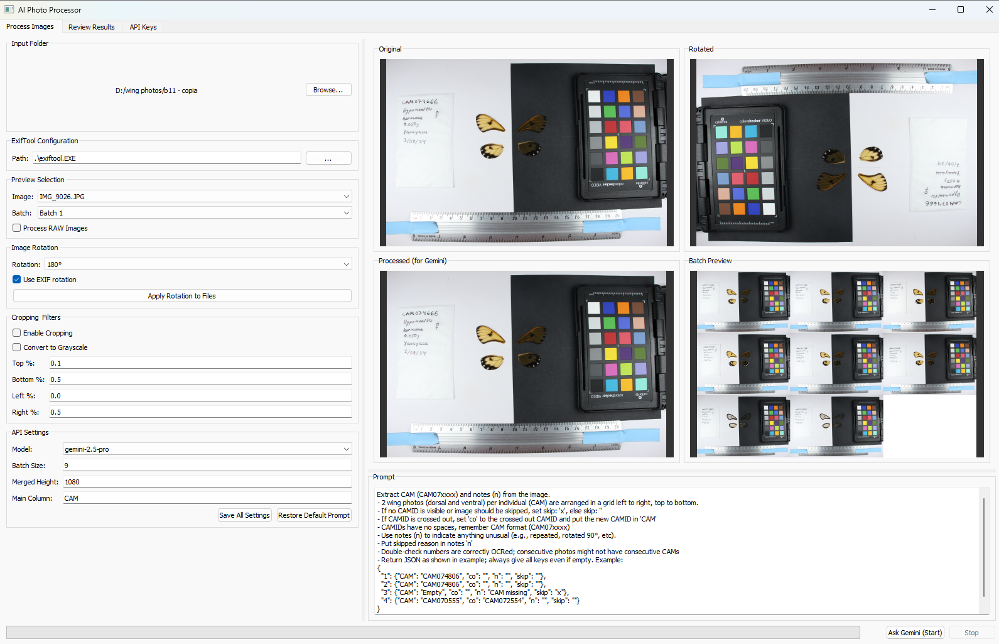

# AI Photo Processor

The AI Photo Processor is a desktop application designed to streamline the process of cataloging large batches of photos, particularly for scientific specimen collections. It leverages the Google Gemini Vision API to automatically extract text-based data (like specimen IDs) from images and provides a powerful interface to review, correct, and rename the corresponding files.



## Key Features

### AI-Powered Data Extraction
- **Gemini Vision OCR**: Extract specimen IDs, notes, and other data using Google's Gemini API (`google-genai` SDK) with customizable prompts
- **Smart Model Selection**: Auto-filters to vision-capable models (2.5+), Flash models first for free-tier compatibility
- **Batch Processing**: Process folders in batches with real-time progress and multi-API key rotation for rate limit handling

### Image Processing
- **Live Previews**: Preview rotation, cropping, and batch merging before sending to API
- **EXIF-Safe Rotation**: Modify orientation tags (not pixels) for JPEG (piexif), HEIC/HEIF (pillow-heif + exiftool), and RAW formats (exiftool)
- **Pre-processing Options**: Crop to focus area, grayscale filter for improved OCR

### Review & Rename
- **Smart Review Grid**: Images grouped by ID with pair verification and mismatch highlighting
- **In-Line Editing**: Edit data directly with autosave; paginated view with adjustable thumbnail quality
- **Safe Renaming**: Generate filenames from IDs, rename with RAW pairing, full undo via logged restore

## Download Standalone App

Ready-to-use standalone applications are available for both Windows and macOS, with no installation required. Just download, unzip, and run!

[**Download Standalone Apps**](https://drive.google.com/drive/folders/1LnEkWZvFuysoqhRLQzDt3aqLw_tX2wW7?usp=sharing)

*   **Windows**: `(New_version)_Windows_Rename_Photos_AI_v2.zip`
*   **macOS**: `Rename_Photos_AI_macOS.zip`

The prebuilt `.zip` file for Windows includes ExifTool v13.32 (downloaded from the official [ExifTool website](https://exiftool.org/)) so you can start processing RAW images right away.

The contents of the Windows zip file are:
```
(New_version)_Windows_Rename_Photos_AI_v2/
│
├── AIPhotoProcessor.exe
├── exiftool.exe
└── exiftool_files/
├── ... (files required by exiftool)
```

## Prerequisites

*   **Google Gemini API Key**: You need at least one API key to use the AI features. You can get your key from [Google AI Studio](https://aistudio.google.com/app/apikey).
*   **Python (for source code users)**: If you are running the application from the source code, you will need Python 3.9 or newer.
*   **ExifTool (for source code users, bundled in prebuilt)**: Required for rotating RAW and HEIC image files. Download it from the official [ExifTool website](https://exiftool.org/) and ensure its location is added to your system's PATH or specified within the app. (Note: ExifTool is bundled in the standalone Windows version and will be automatically detected).

## Installation

### Clone or Download the Repository:
```bash
git clone https://github.com/your-username/your-repo-name.git
cd your-repo-name
```

### Install Dependencies:
It is highly recommended to use a virtual environment.

```bash
# Create and activate a virtual environment (optional but recommended)
python -m venv venv
source venv/bin/activate  # On Windows, use `venv\Scripts\activate`

# Install the required packages
pip install -r requirements.txt
```

## How to Use

### Run the Application:
```bash
python main.py
```

### API Keys Tab:
1. Go to the "API Keys" tab.
2. Paste your Google Gemini API key(s), one per line.
3. Click "Save API Keys".

### Process Images Tab:
1. Click "Browse..." to select the folder containing your images.
2. If you are processing RAW files and exiftool is not in your system's PATH, specify the path to the executable.
3. Adjust rotation, cropping, and batch size settings as needed.
4. Customize the prompt to instruct the AI on what data to extract.
5. Click "Ask Gemini (Start)" to begin the process.

### Review Results Tab:
1. Once processing is complete (or to view a previous session), go to the "Review Results" tab.
2. The most recent CSV data file will be loaded automatically.
3. Review the extracted data and make any corrections in the text fields. Changes are autosaved.
4. When you are satisfied with the data, click "Recalculate Final Names" to generate the new filenames in the 'to' column. This will create a new 'checked' version of your CSV.
5. Finally, click "Rename Files" to apply the new names to your image files on disk.