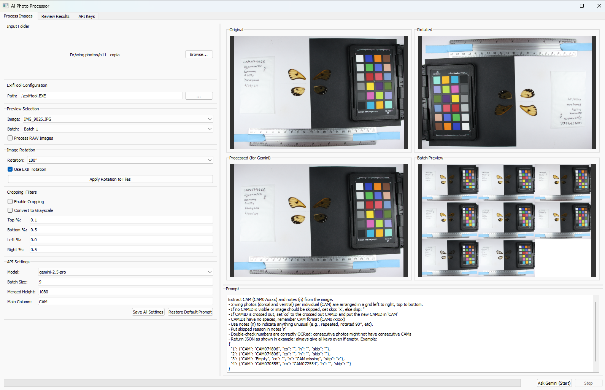

# AI Photo Processor

AI Photo Processor is a browser app for renaming specimen photo batches by the CAMID written on each specimen's envelope. It reads the CAMIDs on your computer, checks them against the specimen database, shows the uncertain photos for review, and renames files with undo support.

Live app: https://fr4nzz.github.io/rename_photos_AI/



## What It Does

- **Reads CAMIDs locally.** A built-in reader (envelope detector, text-line detector and a CAMID recognizer trained on Sanger/Ikiam envelopes) runs in the browser. No API key is needed and photos never leave the computer. See [docs/LOCAL_READER.md](docs/LOCAL_READER.md).
- **Checks every reading** before renaming:
  - the CAMID must exist in the specimen database;
  - it must fit the IDs of the photos taken just before and after it;
  - it must not appear on photos that were not taken back to back.
- **Sends uncertain photos to review.** Each one shows the reason, a zoomed crop of the ID line, a pre-filled suggestion and one-click database IDs. Unconfirmed photos are never renamed.
- **Rotates losslessly.** JPEG and RAW files (CR2, CR3, NEF, ARW, DNG, ORF, PEF) are rotated by changing only their orientation tag. There's no re-encoding and no helper program; Undo writes the old value back.
- **Renames safely.** Every rename is checked first, and names already used by other files are never overwritten. RAW companions are renamed with their JPEGs. A per-folder log in `rename_files/` makes Restore possible.
- **Reads JPEG, PNG, HEIC and RAW.** RAW files are read through their embedded preview.
- **Gemini is still available** as the other reader: grid prompts sent with your own API key.

## Hosted Web App

Open the app here:

https://fr4nzz.github.io/rename_photos_AI/

Use Chrome or Edge. Opening a folder with write access, which rotating and renaming need, uses the File System Access API. The reader's models (about 24 MB) download once and are then cached by the browser. Gemini API keys, if used, are saved locally in your browser.

## Recommended Workflow

Use Chrome or Edge, or Brave with `brave://flags/#file-system-access-api` enabled. Other browsers can only read a folder (they ask to "upload" it, but nothing leaves the computer), so rotating and renaming in place is not available there.

Everything happens in one view:

1. **Open folder**, then filter and select the photos in the grid. The ↺ ↻ 180° buttons rotate the selected photos by hand (lossless, RAW files too); the last button undoes rotations.
2. Click **Run PaddleOCR**. Photos are read in the background, at about 1 s per photo on a laptop.
   - With **Auto-rotate** on (the default), each photo and its RAW files are then turned so the envelope text is upright. Only the orientation tag changes; Undo or Restore reverts it.
   - Photos whose ID could not be read, or is not in the database, are left as they are.
3. The view switches to **Review** (the clipboard button; the grid button goes back to the photos, which now show their CAMIDs, flagged ones outlined; click a CAMID to open its card):
   - The review opens on the photos that need a person.
   - Confirm or correct each one: press Enter, click the check mark, or click a suggestion.
   - The strip at the top shows every CAMID in shooting order, so gaps and repeats stand out.
   - Click **Rename Files**.

## Gemini Mode

Switch the reader to Gemini (the sparkle button next to **Run PaddleOCR**) to use the original prompt-based workflow with your API key. The gear button that appears opens its settings: prompt, grids, model and API keys.

## Gemini Defaults

Gemini mode is tuned for small Gemini messages that work well with Gemini 3.1 Flash Lite:

| Setting | Default |
| --- | --- |
| Model | `gemini-3.1-flash-lite` |
| Grids per message | `1` |
| Grid rows | `2` |
| Grid columns | `2` |
| Merged image height | `1600` |
| Parallel messages | `5` |
| Main column | `CAM` |

The app includes rate-limit pacing so parallel requests do not exceed the configured model family limit.

### Why so few labels per message?

Gemini 3.1 Flash Lite is fast and has a high request allowance (around 15 requests per minute and 500 per day on the current free tier), but it reads handwritten labels more reliably when each request holds only a few of them. The defaults therefore send a single small 2×2 grid (four labels) per request, rather than packing many labels into one image the way heavier models such as Gemini 3 Flash could. This trades fewer labels per request for higher per-label accuracy, and the model's high request limit combined with five parallel requests keeps overall throughput high. If you switch to a stronger model, raise the grid rows and columns to fit more labels per request.

## Run Locally

```bash
git clone https://github.com/Fr4nzz/rename_photos_AI.git
cd rename_photos_AI/web-app
npm install
npm run dev
```

## Verify Before Deploying

```bash
cd web-app
npm run lint
npm test                 # unit tests (orientation, rename planning, RAW previews, reader rules)
npm run build
```

`PARITY=1 npx vitest run src/lib/ocr/__tests__/parity.test.ts` compares the browser reader with the evaluated Python pipeline, which needs the local evaluation data.

GitHub Pages deployment is handled by `.github/workflows/deploy-frontend.yml` when changes are pushed to `main`.

## Legacy Desktop App

Older Python desktop builds are still available from GitHub Releases:

https://github.com/Fr4nzz/rename_photos_AI/releases

Those builds bundled ExifTool for local file metadata operations. The hosted web app now covers everything the desktop app does, including RAW rotation, so it is the recommended version.

## License Notes

This project uses:

- ExifTool by Phil Harvey (desktop app only).
- Google Gemini APIs for the optional Gemini reader.
- ONNX Runtime Web (MIT) to run the local reader.
- PaddleOCR PP-OCRv5 models (Apache-2.0), fine-tuned for the text-line detector and CAMID recognizer.
- A fine-tuned Ultralytics YOLO segmentation model (AGPL-3.0) for envelope segmentation.
- libheif via libheif-js (LGPL-3.0) to decode HEIC photos.
